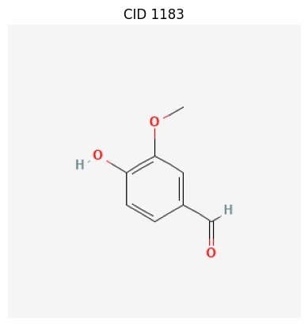

===========
Basic Usage
===========

This guide covers the fundamental features of the ChemInformant library, designed to help users quickly get started with common chemical information query tasks.

.. contents:: Contents
    :local:

-----------------------------------------------------
Core Functionality: Bulk Fetching of Multiple Properties
-----------------------------------------------------

The most central feature of ChemInformant is :func:`~ChemInformant.get_properties`. This function is designed for batch processing, allowing users to query multiple chemical properties for a group of compounds in a single call. This approach is significantly more efficient than querying each compound individually in a loop because it effectively consolidates network requests.

The function accepts a list of various identifiers (such as common names, PubChem CIDs, or SMILES strings) and returns a structured Pandas DataFrame with **standardized snake_case column names**, ready for direct use in subsequent data analysis.

.. note::
   **Snake_case Property Names**: ChemInformant uses consistent snake_case naming (e.g., ``molecular_weight``, ``h_bond_donor_count``) for all returned data. Both snake_case and CamelCase inputs are accepted, but output is always standardized.

.. code-block:: python

    import ChemInformant as ci
    import pandas as pd

    # 1. Define a list containing different types of identifiers
    #    (Aspirin, Caffeine, Acetaminophen)
    identifiers = ['aspirin', 'caffeine', 1983] 

    # 2. Specify the properties you want to fetch (using snake_case names)
    properties_to_fetch = ['molecular_weight', 'xlogp', 'cas', 'iupac_name']

    # 3. Call the core function to perform the query
    data_frame = ci.get_properties(identifiers, properties_to_fetch)

    # 4. View the resulting DataFrame
    print(data_frame.to_string())

Output:

.. code-block:: text

  input_identifier    cid    status  molecular_weight  xlogp     cas        iupac_name
  ------------------  -----  ------  ----------------  -----     -------    ---------------------------------
  aspirin             2244.0   OK    180.16            1.20      50-78-2    2-(acetyloxy)benzoic acid
  caffeine            2519.0   OK    194.19            -0.07     58-08-2    1,3,7-trimethylpurine-2,6-dione
  1983                1983.0   OK    151.16            0.51      103-90-2   N-(4-hydroxyphenyl)acetamide

---------------------------------------------------------
Getting All Properties or Including 3D Descriptors
---------------------------------------------------------

ChemInformant offers convenient options to retrieve comprehensive data sets:

.. code-block:: python

    # Get all ~40 available properties for a compound
    complete_data = ci.get_properties(['aspirin'], all_properties=True)
    print(f"Retrieved {len(complete_data.columns)} columns of data")

    # Get core properties plus 3D molecular descriptors
    data_with_3d = ci.get_properties(['aspirin'], include_3d=True)
    
    # Both approaches are much more efficient than multiple API calls

The ``all_properties=True`` option retrieves every available property from PubChem, including core properties, 3D descriptors, and special properties like CAS numbers and synonyms. The ``include_3d=True`` option adds 3D molecular descriptors to the default core property set.

------------------------------------------------
Getting Complete Information for a Single Compound
------------------------------------------------

When you need to retrieve all available information for a single compound, use the :func:`~ChemInformant.get_compound` function. It returns a :class:`~ChemInformant.Compound` data object, which neatly encapsulates all properties. Specific information can be conveniently accessed via attribute access (dot notation).

.. code-block:: python

    import ChemInformant as ci

    # Get complete information for caffeine using its name
    caffeine = ci.get_compound('caffeine')

    # Access the object's various attributes using dot notation
    if caffeine:
        print(f"Query Identifier: {caffeine.input_identifier}")
        print(f"PubChem CID: {caffeine.cid}")
        print(f"IUPAC Name: {caffeine.iupac_name}")
        print(f"Molecular Formula: {caffeine.molecular_formula}")
        print(f"Molecular Weight: {caffeine.molecular_weight}")
        
        # The object also contains automatically calculated properties, such as the PubChem link
        print(f"PubChem Link: {caffeine.pubchem_url}")

Output:

.. code-block:: text

    Query Identifier: caffeine
    PubChem CID: 2519
    IUPAC Name: 1,3,7-trimethylpurine-2,6-dione
    Molecular Formula: C8H10N4O2
    Molecular Weight: 194.19
    PubChem Link: https://pubchem.ncbi.nlm.nih.gov/compound/2519

-----------------------------
Convenient Shortcut Functions
-----------------------------

To simplify queries for a single property, ChemInformant provides a series of shortcut functions, such as :func:`~ChemInformant.get_weight` and :func:`~ChemInformant.get_cas`. These functions are lightweight wrappers around :func:`~ChemInformant.get_properties`, making the code more concise when only a single data point is needed.

.. code-block:: python

    import ChemInformant as ci

    # Get the molecular weight of aspirin
    aspirin_weight = ci.get_weight('aspirin')
    print(f"Molecular weight of aspirin: {aspirin_weight}")

    # Get the CAS number for water
    water_cas = ci.get_cas('water')
    print(f"CAS number for water: {water_cas}")

    # Get the molecular formula for ethanol (using a SMILES identifier)
    ethanol_formula = ci.get_formula('CCO')
    print(f"Molecular formula of ethanol: {ethanol_formula}")

Output:

.. code-block:: text

    Molecular weight of aspirin: 180.16
    CAS number for water: 7732-18-5
    Molecular formula of ethanol: C2H6O

ChemInformant provides **22 convenience functions** for individual properties, covering molecular descriptors, structural features, mass properties, and identifiers. All functions return None for compounds that cannot be found, making error handling straightforward.

-----------------------------
Visualizing Compound Structures
-----------------------------

The library also provides the :func:`~ChemInformant.draw_compound` function for drawing 2D structural diagrams of compounds. This feature requires the installation of an optional plotting dependency.

The function calls PubChem's imaging service and uses Matplotlib to display it.

.. code-block:: python

    import ChemInformant as ci

    # Draw the structure of Vanillin
    # After executing the code, a new window will pop up to display the image
    ci.draw_compound('Vanillin')

When executed, an image window containing the chemical structure of Vanillin will be displayed.

