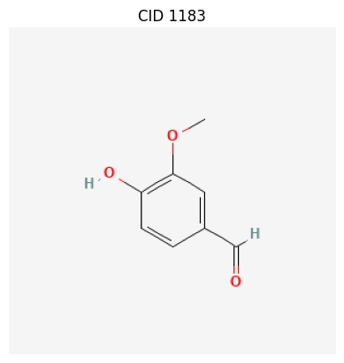

===============================
Command-Line Interface (CLI)
===============================

ChemInformant provides a suite of command-line interface (CLI) tools, designed to enable users to interact directly with the PubChem database from a terminal environment. This suite includes `chemfetch` for data retrieval and `chemdraw` for structure visualization. They are designed as standalone, powerful programs that can be easily integrated into automation scripts and data analysis workflows.

.. contents::
   :local:

`chemfetch`
-----------

`chemfetch` is ChemInformant's core data retrieval tool. Its primary responsibility is to accept one or more chemical identifiers provided by the user, initiate a request to the PubChem API to fetch specified chemical properties, and return the results to standard output in a user-selected format. The tool can automatically recognize various identifier types and robustly handle batch requests that include invalid identifiers.

**Usage**

.. code-block:: bash

   chemfetch [identifiers...] [options]

**Parameters and Options**

.. option:: identifiers

   One or more required chemical identifiers, separated by spaces. The internal logic of `chemfetch` will attempt to parse the type of each identifier:

   *   **Name:** e.g., ``aspirin``, ``caffeine``, ``water``. The tool uses these names to search in PubChem.
   *   **PubChem Compound ID (CID):** e.g., ``2244`` for aspirin. This is a specific and unambiguous identifier.
   *   **SMILES String:** e.g., ``"CC(=O)Oc1ccccc1C(=O)O"``. This is a linear notation for describing a compound's structure.

   .. note::
      When a provided SMILES string contains characters that might be interpreted by the shell as special operators (e.g., `(`, `)`, `=`, `#`), it is strongly recommended to enclose the entire string in single or double quotes to ensure it is passed as a single, complete argument to `chemfetch`.

.. option:: --props <property_list>

   A comma-separated list of properties to precisely specify which data to retrieve for each identifier. If the user does not provide this option, `chemfetch` will use a default set of properties: ``cas,molecular_weight,iupac_name``.

   **The complete list of available properties includes:**

   *   ``cas``: CAS Registry Number, a common chemical identifier.
   *   ``molecular_weight``: Molecular weight, in g/mol.
   *   ``molecular_formula``: Molecular formula, indicating the number of atoms of each element in the compound.
   *   ``canonical_smiles``: Canonical SMILES string, a standardized, unique SMILES representation.
   *   ``isomeric_smiles``: Isomeric SMILES string, which can represent specific stereoisomers.
   *   ``iupac_name``: The systematic name established by the International Union of Pure and Applied Chemistry (IUPAC).
   *   ``xlogp``: The theoretically calculated octanol-water partition coefficient, often used to assess a drug's lipophilicity.
   *   ``synonyms``: A list containing all known synonyms for the compound, such as trade names, common names, etc.

.. option:: -f, --format <format_type>

   This option controls the format of the output. The default value is ``table``.

   *   ``table``: Outputs a well-aligned, human-readable text table.
   *   ``csv``: Outputs data following the Comma-Separated Values (CSV) specification. This format is ideal for importing into spreadsheet software (like Excel, Google Sheets) or data analysis libraries (like Python Pandas).
   *   ``json``: Outputs a JSON array, where each element is a JSON object representing the compound's information. This format is designed for programmatic processing and API interaction.

**Basic Examples**

1.  **Performing a Basic Query**

    This command will fetch the default set of properties for aspirin and caffeine and display the results in the default table format.

    .. code-block:: bash

       chemfetch aspirin caffeine

    **Terminal Output:**

    .. code-block:: text

       input_identifier   cid            status  cas         molecular_weight iupac_name
              aspirin  2244                OK  50-78-2             180.16 2-(acetyloxy)benzoic acid
             caffeine  2519                OK  58-08-2             194.19 1,3,7-trimethylpurine-2,6-dione

2.  **Handling a Mix of Valid and Invalid Identifiers**

    An important feature of `chemfetch` is its error handling capability. When processing a list containing identifiers that are unrecognized or non-existent, the program does not halt execution. Instead, it reports the retrieval status (`status` column) for each input identifier while returning the requested data for all successfully found identifiers.

    .. code-block:: bash

       chemfetch caffeine "ThisIsA_FakeCompound" 999999999

    **Terminal Output:**

    .. code-block:: text

       input_identifier            cid        status         cas         molecular_weight                   iupac_name
                 caffeine           2519            OK     58-08-2             194.19  1,3,7-trimethylpurine-2,6-dione
       ThisIsA_FakeCompound        <NA>   NotFoundError        <NA>                  NaN                             <NA>
              999999999           <NA>   NotFoundError        <NA>                  NaN                             <NA>

**Using `chemfetch` in Data Processing Pipelines**

A core design philosophy is to enable `chemfetch` to serve as a component in data processing pipelines within a Unix/Linux environment. By setting its output format to `json` or `csv`, you can seamlessly stream the data returned by ChemInformant to other powerful command-line tools for complex filtering, transformation, and analysis.

**Scenario 1: Processing JSON Output with `jq`**

The JSON format is particularly well-suited for use with `jq`, a powerful command-line JSON processor.

First, we run `chemfetch` and specify the `json` format to retrieve the data:

.. code-block:: bash

   chemfetch aspirin caffeine --props cas,molecular_weight --format json

The standard output of this command will be a JSON array:

.. code-block:: json

   [
     {
       "input_identifier": "aspirin",
       "cid": "2244",
       "status": "OK",
       "cas": "50-78-2",
       "molecular_weight": 180.16
     },
     {
       "input_identifier": "caffeine",
       "cid": "2519",
       "status": "OK",
       "cas": "58-08-2",
       "molecular_weight": 194.19
     }
   ]

Next, we can use the pipe operator `|` to pass this JSON output to `jq` for processing.

*   **Task: Extract only the CAS numbers of all successfully retrieved compounds.**

    .. code-block:: bash

       chemfetch aspirin caffeine --props cas,molecular_weight --format json | jq -r '.[] | select(.status == "OK") | .cas'

    **Command Breakdown:**
      *   `|`: The pipe operator, which sends the standard output of the command on the left (`chemfetch`) to the standard input of the command on the right (`jq`).
      *   `jq -r '...'`: Invokes `jq`. The `-r` (raw output) option removes quotes from the output strings, making them plain text.
      *   `'.[] | ...'`: `.` represents the entire input JSON array, and `.[]` expands it into a stream of objects.
      *   `select(.status == "OK")`: This is a filter that only allows objects where the `status` field has the value `"OK"` to pass through.
      *   `.cas`: For each object that passes the filter, this extracts the value of its `cas` field.

    **Final Output:**

    .. code-block:: text

       50-78-2
       58-08-2

*   **Task: Filter for compounds with a molecular weight greater than 190 and reconstruct them into a new, more concise JSON structure.**

    .. code-block:: bash

       chemfetch aspirin caffeine ethanol --props molecular_weight --format json | jq '[.[] | select(.molecular_weight > 190)]'

    **Command Breakdown:**
      *   `select(.molecular_weight > 190)`: Here, the filter condition is a numerical comparison, and only objects with a molecular weight greater than 190 will pass.
      *   `[...]`: Re-collects the final stream of objects into a JSON array.

    **Final Output:**

    .. code-block:: json

       [
         {
           "input_identifier": "caffeine",
           "cid": "2519",
           "status": "OK",
           "molecular_weight": 194.19
         }
       ]

**Scenario 2: Processing CSV Output with `awk`**

When dealing with row-oriented records, the CSV format can be conveniently used with classic Unix tools like `awk`, `cut`, etc.

*   **Task: Extract the identifier and molecular weight (columns 1 and 4) from the CSV output, skipping the CSV header.**

    .. code-block:: bash

       chemfetch aspirin caffeine ethanol --props molecular_weight --format csv | awk -F, 'NR > 1 {print "Compound:", $1, "| Weight:", $4}'

    **Command Breakdown:**
      *   `awk -F, '...'`: Invokes `awk`. The `-F,` argument sets the field separator to a comma.
      *   `NR > 1`: This is an `awk` pattern. `NR` is a built-in `awk` variable representing the "number of the current record (row)." This pattern means the following action is only executed for row numbers greater than 1, effectively skipping the header on the first line.
      *   `{print ...}`: This is the action to be performed. `$1` and `$4` represent the first and fourth fields of the current row, respectively.

    **Final Output:**

    .. code-block:: text

       Compound: aspirin | Weight: 180.16
       Compound: caffeine | Weight: 194.19
       Compound: ethanol | Weight: 46.07

`chemdraw`
----------

The `chemdraw` tool provides a quick way to invoke and display a compound's 2D structure from the terminal. Upon execution, if the lookup is successful, the program will open a window to display the compound's structure image fetched from PubChem.

.. warning::
   This feature depends on optional plotting libraries (`matplotlib` and `Pillow`). These libraries are not core dependencies of `ChemInformant` and are therefore not automatically included in a standard installation. To enable the functionality of `chemdraw`, you must explicitly specify the "plot" extra feature group during installation. Please use the following command to install:

   .. code-block:: bash

      pip install ChemInformant[plot]

**Usage**

.. code-block:: bash

   chemdraw [identifier]

**Parameters**

.. option:: identifier

   A required chemical identifier (can be a name, CID, or SMILES string) used to specify which compound's structure to draw.

**Examples**

1.  **Drawing a Structure by Name**

    .. code-block:: bash

       chemdraw "Vanillin"

    After executing this command, a Matplotlib window will pop up, containing the chemical structure diagram of vanillin.

2.  **Drawing a Structure from a SMILES String**

    .. code-block:: bash

       # Draw the structure of benzoic acid
       chemdraw "c1ccc(cc1)C(=O)O"

.. image:: /_static/Figure_1.png
   :width: 500px
   :align: center

3.  **Error Handling for Unfound Compounds**

    If the provided identifier cannot be resolved to a unique compound in PubChem, `chemdraw` will terminate execution and print a clear error message to the standard error stream (stderr) without producing any graphical output.

    .. code-block:: bash

       chemdraw "MyImaginaryMolecule"

    **Standard Error Output:**

    .. code-block:: text

       Attempting to draw structure for 'MyImaginaryMolecule'...
       [ChemInformant] Error: Identifier 'MyImaginaryMolecule' was not found in PubChem.