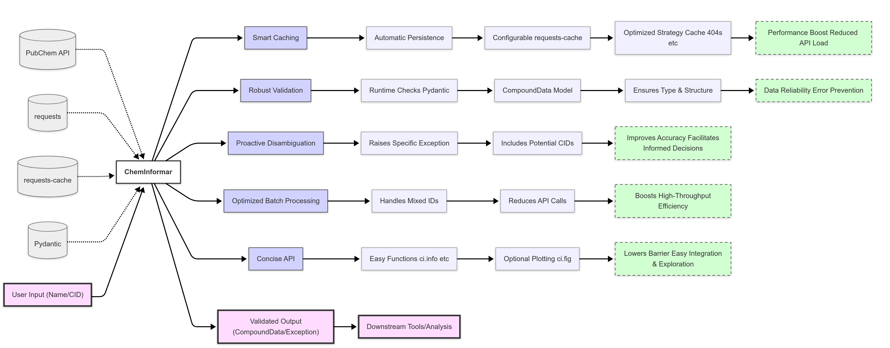

## Summary

ChemInformant provides a **lightweight Pythonic interface** characterized by its ease of use for accessing chemical compound data from the PubChem database [@PubChem; @Kim2016NAR]. Designed to abstract the complexities of the PubChem API (`import ChemInformant as ci`), it facilitates streamlined data retrieval for researchers. Key distinguishing features include **built-in automatic caching** via `requests-cache` [@RequestsCache], which enhances performance and contributes to reproducibility; **structured data validation** using Pydantic [@Pydantic] models (`CompoundData`), promoting data quality; **explicit handling of chemical name ambiguity**, enhancing accuracy; and **optimized batch retrieval**. Furthermore, ChemInformant is built upon a minimal set of **modern, actively maintained core dependencies** (`requests` [@Requests], `requests-cache`, `Pydantic`), which contributes to its long-term stability and compatibility. This design addresses certain limitations associated with direct API utilization and offers enhancements over existing tools that may be built upon less contemporary or less actively maintained software foundations. ChemInformant is designed as a reliable and efficient tool for routine chemical information retrieval.

## Statement of Need

Programmatic access to PubChem [@PubChem] is integral for numerous chemistry-related research tasks; however, direct utilization of the PUG REST API [@Kim2018JCheminform; @Kim2018PUGREST] can entail considerable overhead in request handling, response parsing, error management, and data validation. This inherent complexity can impede research progress and potentially introduce errors.

While existing libraries, such as PubChemPy [@PubChemPy], provide an interface to PubChem, `ChemInformant` was developed to address specific limitations and to offer a contemporary, robust, and efficient alternative tailored to common research workflows by focusing on the following aspects:

1.  **Dependency Modernity and Maintenance:** `ChemInformant` is designed to rely on a small set of ubiquitous, actively developed, and well-maintained libraries (`requests` [@Requests], `requests-cache` [@RequestsCache], `Pydantic` [@Pydantic]). This approach supports long-term stability, security, and compatibility with evolving Python [@Python] environments.
2.  **Integrated Automatic Caching:** `ChemInformant` integrates `requests-cache` **by default**. This feature provides transparent, persistent caching, which substantially improves performance for repeated queries and batch operations, enhances operational stability during network variability, and contributes to the reproducibility of analyses. The caching is also readily configurable (`ci.setup_cache()`).
3.  **Rigorous Data Validation and Structure:** `ChemInformant` employs Pydantic to define a clear `CompoundData` model, ensuring that retrieved data are validated at runtime, data types are enforced, and users interact with consistently structured objects.
4.  **Explicit Ambiguity Handling:** `ChemInformant` explicitly addresses chemical name ambiguity by raising a distinct `AmbiguousIdentifierError` containing all potential CIDs, thereby preventing silent failures or arbitrary selections.
5.  **Simplicity and Ease of Use:** The API is designed to be Pythonic and intuitive (e.g., `ci.info()`, `ci.cas()`), reducing the adoption barrier for researchers seeking to integrate PubChem data access into Python scripts or Jupyter notebooks [@Jupyter].

Through these focused enhancements, `ChemInformant` serves as a reliable, efficient, and developer-friendly tool for routine chemical information retrieval tasks. The target users include cheminformatics researchers, drug discovery scientists, computational chemists, data scientists, and educators.

## Key Functionality and Architecture

ChemInformant's capabilities are delivered through a modular architecture (refer to Figure 1) and are characterized by the following key features:

*   **Lightweight & Pythonic Interface:** A concise API accessible via the `ci` alias (e.g., `ci.info()`, `ci.cid()`).
*   **Built-in Automatic Caching:** Leverages `requests-cache` [@RequestsCache] for transparent caching (default: SQLite, 7-day expiry, caches 404 responses), configurable via `ci.setup_cache()`.
*   **Structured Validated Data:** Utilizes a Pydantic [@Pydantic] `CompoundData` model for data consistency and robustness.
*   **Explicit Ambiguity Handling:** Raises `AmbiguousIdentifierError` for ambiguous names and `NotFoundError` for unfound identifiers.
*   **Optimized Batch Data Retrieval:** Employs `ci.get_multiple_compounds()` for efficient processing of compound lists.
*   **Modern Dependencies:** Built upon `requests` [@Requests], `requests-cache`, and `Pydantic`.

{#fig:architecture_flowchart}

Figure 1: ChemInformant architecture. Inputs (user input, PubChem API, dependencies) flow into the central component. ChemInformant utilizes key features (smart caching, robust validation, proactive disambiguation, optimized batch processing, concise API) to produce validated outputs (`CompoundData` objects or specific exceptions), suitable for downstream tools and analysis.

## Example Usage

The following example demonstrates basic usage of ChemInformant:

```python
# Recommended import alias
import ChemInformant as ci

# Optional: Configure cache (e.g., in-memory, 1-hour expiry)
# ci.setup_cache(backend='memory', expire_after=3600)

# Retrieve basic information about Aspirin (by name or CID)
compound = ci.info("Aspirin")
print("Name:", compound.common_name)
print("Formula:", compound.molecular_formula)
print("Weight:", compound.molecular_weight)
print("PubChem URL:", compound.pubchem_url)

# Display 2D structure (requires Pillow and matplotlib)
ci.fig(compound.cid)

# Retrieve CAS number for Ethanol (CID = 702)
ethanol_cas = ci.cas(702)
print("Ethanol CAS:", ethanol_cas)

# Batch retrieval: mix of names and CIDs
ids = ["Water", 2244, "NonExistent", "glucose"]
results = ci.get_multiple_compounds(ids)

print("\nBatch Results:")
for ident, result in results.items():
    if isinstance(result, ci.CompoundData):
        print(ident, "→", result.molecular_formula)
    else:
        print(ident, "→", type(result).__name__)

```
## Feature Comparison and Advantages

The features detailed in Table 1, particularly when contrasted with the baseline (PCP v1.0.4), highlight ChemInformant's potential to enhance efficiency, data reliability, and overall robustness in routine cheminformatics workflows. Its design philosophy prioritizes ease of use alongside modern software engineering practices.

**Table 1: Comparative analysis of cheminformatics features: ChemInformant (CI) versus PubChemPy (PCP v1.0.4 baseline).**

| Feature (Cheminformatics Relevance)                             | ChemInformant (CI)                                                                                                                                                                                             | PubChemPy (PCP v1.0.4)                                                                                                                                                                                                |
| :-------------------------------------------------------------- | :------------------------------------------------------------------------------------------------------------------------------------------------------------------------------------------------------------- | :-------------------------------------------------------------------------------------------------------------------------------------------------------------------------------------------------------------------- |
| **Automatic Persistent HTTP Caching**<br/>(Efficiency in Repetitive Data Access) | Implements built-in, transparent HTTP caching via `requests-cache`, configurable (e.g., SQLite backend, 7-day expiry, caches 404 responses). This significantly accelerates repetitive chemical data lookups by minimizing network requests. | Lacks a global persistent HTTP response caching mechanism; primarily relies on instance-level attribute caching for chemical properties. This approach is less effective for performance optimization across sessions or during large dataset processing. |
| **Runtime Data Validation**<br/>(Integrity of Chemical Information)          | Employs Pydantic models (`CompoundData`) for **strict structural and data type validation** of retrieved chemical data (e.g., SMILES, MW, InChI). This ensures data integrity for subsequent modeling or analysis tasks.      | Does not incorporate an explicit client-side data validation layer for chemical attributes. Consequently, there is a potential for inconsistent data types or structures to propagate into downstream processes.                 |
| **Chemical Name Disambiguation**<br/>(Accuracy of Identifier Mapping)        | **Proactively raises an `AmbiguousIdentifierError`** with candidate CIDs for ambiguous chemical names. This mechanism guides users towards accurate entity selection, crucial for maintaining dataset quality.           | Typically returns a list of matching chemical entities, necessitating user-side logic for disambiguation. This may introduce a higher propensity for errors in automated workflows if not explicitly handled.               |
| **Optimized Batch Retrieval**<br/>(Efficiency for Multiple Entities/Properties) | Single call to `ci.get_multiple_compounds(ids)`: supports mixed ID types, automatically handles classification, pagination (≤ 200 entries/batch), and rate limiting (≤ 5 reqs/sec); error entries are encapsulated as exception objects, while valid entries return complete `CompoundData`. | Requires users to manually split IDs by namespace, then loop through `get_properties` / `get_compounds`, and self-manage request rates (e.g., via `sleep`); if batch size exceeds limits or URL construction is incorrect, the entire batch request fails. |
| **Integrated 2D Chemical Structure Plotting**<br/>(Rapid Visual Inspection)    | Includes a convenience function, `ci.fig()` (requires `matplotlib`, `Pillow`), for direct 2D visualization of chemical structures, facilitating quick data exploration and reporting.                              | Lacks a built-in, direct display function for chemical structures; provides image URLs that require user-side processing for visualization.                                                                                |
| **Core Dependency Status**<br/>(Long-term Sustainability and Ecosystem Integration) | Relies on **modern, actively maintained libraries** (`requests`, `requests-cache`, `Pydantic`), ensuring long-term viability and robust integration with other contemporary cheminformatics tools.                | The library (v1.0.4) has not received significant updates since its 2017 release. This raises potential concerns regarding long-term maintenance and compatibility within evolving cheminformatics pipelines.               |


## Acknowledgement

We acknowledge the PubChem database [@PubChem] as the primary data source. This work utilizes a series of open-source Python libraries for tasks including data requests, caching, validation, as well as optional image processing and data visualization.


